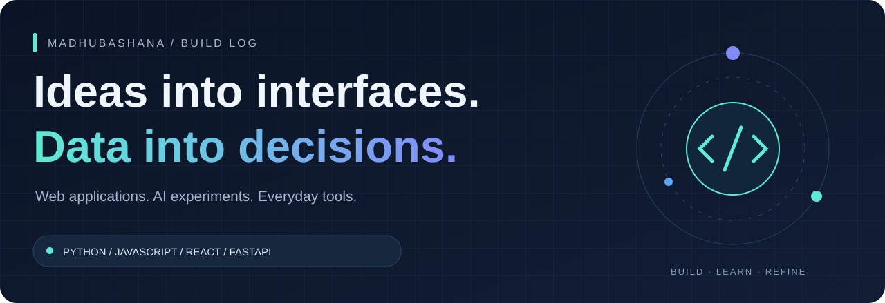
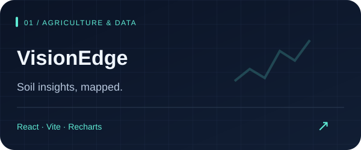
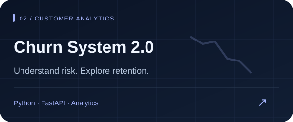
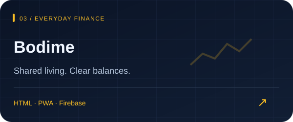
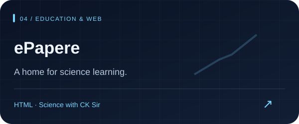

### Hi, I'm Madhubhashana 👋

I build across **web, data, and everyday problems** — from soil dashboards and customer analytics to shared expenses and learning platforms.

**Build something useful. Learn from it. Make it better.**

---

## Selected work

<table>
<tr>
<td width="50%" valign="top">

Explore soil measurements, locations, and trends through an interactive dashboard with maps and charts.

<a href="https://github.com/madhubashana112/VisionEdge-projectv1.3"><strong>Explore v1.3 →</strong></a> · <a href="https://github.com/madhubashana112/VisionEdge-projectv1.2">v1.2</a>

</td>
<td width="50%" valign="top">

Turn customer data into risk scores and retention dashboards for SaaS, telecom, and fintech.

<a href="https://github.com/madhubashana112/churn-system-2.0"><strong>Explore the repository →</strong></a>

</td>
</tr>
<tr>
<td width="50%" valign="top">

Split boarding-house expenses, see who owes whom, and track balances. Supports Sinhala, English, and offline use.

<a href="https://github.com/madhubashana112/PWA_type_bodima"><strong>Explore the repository →</strong></a>

</td>
<td width="50%" valign="top">

A science-class website for CK Sir, bringing class information, learning resources, and enrollment guidance together.

<a href="https://github.com/madhubashana112/epapere.com"><strong>Explore the repository →</strong></a>

</td>
</tr>
</table>

## My project toolkit

| Area | Technologies used across my projects |
| :--- | :--- |
| Interfaces | JavaScript · React · Vite · HTML |
| Data & APIs | Python · FastAPI · Recharts |
| Maps & applications | Leaflet · Firebase · Progressive Web Apps |
| Version control | Git · GitHub |

## The complete collection

All 16 publicly visible repositories, including project versions, experiments, a learning fork, and this profile repository.

### 🧠 AI & data projects

| Repository | Overview |
| :--- | :--- |
| [**churn-system-2.0**](https://github.com/madhubashana112/churn-system-2.0) | Churn analysis, risk scoring, and retention dashboards · Python |
| [**churnsystem**](https://github.com/madhubashana112/churnsystem) | Alibaba AI buildathon project · Python |
| [**churnmanagement**](https://github.com/madhubashana112/churnmanagement) | Alibaba AI buildathon repository |
| [**Sentiment-Analysis-project**](https://github.com/madhubashana112/Sentiment-Analysis-project) | Sentiment analysis project |
| [**seelook-ai-main**](https://github.com/madhubashana112/seelook-ai-main) | SeeLook AI repository |

### 🌐 Web applications

| Repository | Overview |
| :--- | :--- |
| [**VisionEdge-projectv1.3**](https://github.com/madhubashana112/VisionEdge-projectv1.3) | Soil-data dashboard with maps and charts · React, Vite |
| [**VisionEdge-projectv1.2**](https://github.com/madhubashana112/VisionEdge-projectv1.2) | VisionEdge v1.2 · JavaScript |
| [**PWA_type_bodima**](https://github.com/madhubashana112/PWA_type_bodima) | Shared expenses and balance settlement for boarding houses · HTML, PWA |
| [**epapere.com**](https://github.com/madhubashana112/epapere.com) | Science-class website for CK Sir · HTML |

### 📋 STT project collection

| Repository | Overview |
| :--- | :--- |
| [**STT-plan-APP**](https://github.com/madhubashana112/STT-plan-APP) | STT plan application · JavaScript |
| [**cksir-stt-plan-**](https://github.com/madhubashana112/cksir-stt-plan-) | CK Sir STT plan repository |
| [**cksir-stt-plan-v2**](https://github.com/madhubashana112/cksir-stt-plan-v2) | CK Sir STT plan v2 repository |

### 🛠️ More projects & learning

| Repository | Overview |
| :--- | :--- |
| [**PeraBots**](https://github.com/madhubashana112/PeraBots) | PeraBots project repository |
| [**SOLO-DEVELOPER**](https://github.com/madhubashana112/SOLO-DEVELOPER) | Personal project repository |
| [**Github-for-beginners**](https://github.com/madhubashana112/Github-for-beginners) | GitHub workflow practice · Forked learning repository |
| [**madhubashana112**](https://github.com/madhubashana112/madhubashana112) | The README and configuration behind this profile |

Some repositories are early starting points. See individual repositories for implementation details, current status, and acknowledgements.

---

### Always another idea to explore.

Thanks for visiting my build log.

[Browse the code](https://github.com/madhubashana112?tab=repositories) · [Explore my GitHub](https://github.com/madhubashana112)

MADHUBASHANA / CODE · CREATE · KEEP LEARNING

